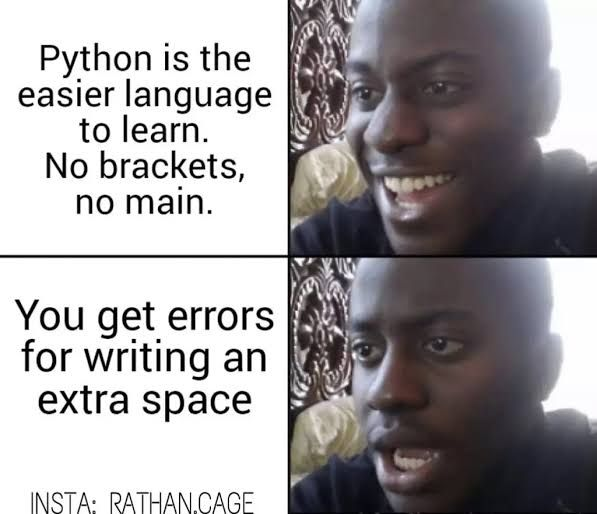

# Advanced Programming Course - HW5
<p  align="center"> <b>Homework 5 - Fall 2022 Semester <br> Deadline: Yekshanbe 11 day - 11:59 pm</b> </p>

</br>

## **Outline**
This homework has 2 parts:

- In the first part, we are going to work with classes and inheritance in python. this part will be implemented using the docker and the Dockerfile.
- In the second part of the homework we will work with matplotlib in python. This part should be implemented without docker and directly on your own system.


</br>
</br>


## **Python Class and Inheritance**
In this section we will implement a class for basic geometry shapes. write your codes for this part in `src/shape.py`.

## Point class
This class represents a point in a 2D plane.
```py
class Point:
    def __init__(self, x:float, y:float) -> None:
        pass
```
store the `x` and `y` variables in the class. and then define the following member fnuctions.

- **print function**<br/>
Make arrangements so that you will be able to print an instance of `Point` class. the output should be like this:
	```sh
	x: 2.5, y: 3
	```

- **+/- operator**<br/>
Make arrangements so you can add or subtract 2 points. i.e. tests 2 and 3 should work properly.

- **length**<br/>
define a function called `length` and return the length of the line connecting origin to the point.


## Shape class
This class represents any shape in a 2D plane.
```py
class Shape:
    def __init__(self) -> None:
        self.vertices = []
```
All shapes are made different vertices. the `vertices` member variable is responsible to store them.
define the following member functions for the Shape class.

- **add_vertex**<br/>
This member function adds an vertex to our shape.
	```py
	def add_vertex(self, p:Point) -> None:
        pass
	```

- **print function**<br/>
Make arrangements so that you will be able to print an instance of `Shape` class. only print out the number of vertices of the class:
	```sh
	number of vertices: 3
	```

- **perimeter**<br/>
returns the perimeter of our shape.
	```py
	def perimeter(self) -> float:
        pass
	```


## Line class
This class represents a line in a 2D plane and inherits from the `Shape` class.
```py
class Line(Shape):
    def __init__(self, p1:Point, p2:Point) -> None:
        pass
```
A line will have 2 vertices which we gets them from the `Line` constructor. **DO NOT** add any member variables for this class.

- **print function**<br/>
Make arrangements so that you will be able to print an instance of `Line` class. The output should be something like:
	```sh
	Line:
		p1: (x: -1, y: 2)
		p2: (x: 1, y: 4)
	```

- **area**<br/>
returns the area of our shape which is always 0.
	```py
	def area(self) -> float:
        pass
	```


## Triangle class
This class represents a triangle in a 2D plane and inherits from the `Shape` class.
```py
class Triangle(Shape):
    def __init__(self, p1:Point, p2:Point, p3:Point) -> None:
        pass
```
A line will have 3 vertices which we gets them from the `Triangle` constructor. **DO NOT** add any member variables for this class.

- **print function**<br/>
Make arrangements so that you will be able to print an instance of `Triangle` class. The output should be something like:
	```sh
	Triangle:
		p1: (x: 0, y: 0)
		p2: (x: 0, y: 3)
		p3: (x: 4.1, y: 0)
	```

- **area**<br/>
returns the area of our triangle.
	```py
	def area(self) -> float:
        pass
	```

## Rectangle class
This class represents a rectangle in a 2D plane and inherits from the `Shape` class.
```py
class Rectangle(Shape):
    def __init__(self, p1:Point, p2:Point) -> None:
        pass
```
A line will have 4 vertices. we can construct these vertices using only the *top-left* and *bottom-right* vertices which we will get them from the constructor. **DO NOT** add any member variables for this class.

- **print function**<br/>
Make arrangements so that you will be able to print an instance of `Rectangle` class. The output should be something like:
	```sh
	Rect:
		p1: (x: 0, y: 0)
		p2: (x: 2, y: 0)
		p3: (x: 2, y: 2)
		p4: (x: 0, y: 2)
	```

- **area**<br/>
returns the area of our rectangle.
	```py
	def area(self) -> float:
        pass
	```

</br>
</br>

## **Matplotlib**
Using the image in `resources/image.jpg` implement the following plot using matplotlib in `src/daemon_figure.py` and show the figure at the end.
(see `resources/image.gif` if *following plot* is not loading)


<br>
<p align="center">

</p>
<br>


</br>


# **Finally**
Please do not alter other files already populated except otherwise indicated. only write your code in `src/shape.py` and `src/daemon_figure.py` files.

</br>

<p  align="center"> <b>GOOD LUCK</b> </p>


<br/>
<p align="center">

</p>
<br/>